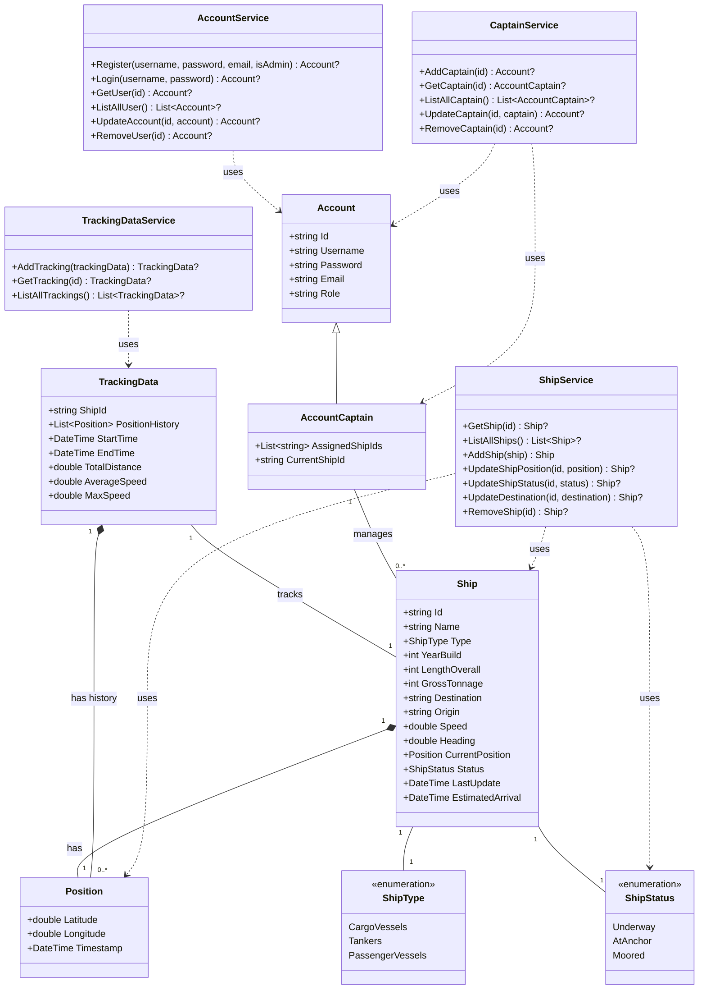

# NavyRadar

Desktop application for navy radar

Kelompok Mesin Rumput S8000

Ketua Kelompok: Hilmi Musyaffa - 23/516589/TK/56795

Anggota 1: Christian Kevin Andhika Danidaiva - 23/513576/TK/56433

Anggota 2: Harun - 23/514148/TK/56466

Anggota 3: Hilmi Musyaffa - 23/516589/TK/56795

## Class Diagram

## ER Diagram

<picture>
  <source media="(prefers-color-scheme: dark)" srcset="https://github.com/user-attachments/assets/a88207f2-8a23-4f35-adfe-5d5622b0ac0d">
  
</picture>
